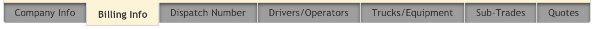
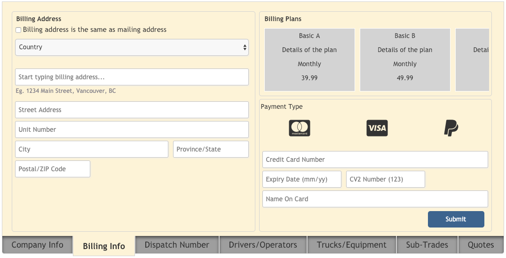

## mjfTabBar

Creates a basic tab bar inside the associated div element.  You still need to create the body of the tab (the section above the tab) as illustrated in the screenshot which you can change with the selection of each tab.

Basic tabs without any body attached yet...

Example of basic tabs with a body styled to match tabs...

## Install
    meteor add michaelfalk:mjf-tab-bar

## Quick Use

In your onRendered or onCreated helpers (or wherever)...

	$('#myTabBar').mjfTabBar({
            tabBarId: 'String value', //optional
            tabs: ['tab1', 'tab2', 'etc...'],
            activeTabColor: 'rgba() or hex', //optional
            inActiveTabColor: 'rgba() or hex', //optional
            inActiveHoverTabColor: 'rgba() or hex', //optional
            tabFontSize: 'XXpx', //optional (px or any font-size variation allowed by CSS rules)

            onSelect: function(data) { //optional... but what good would it be without any action...? ;)
                ...do something here with 'data' if you please...
            }
        });

## Summary

Creates a basic tab bar inside the associated div element

## Example:
 
 In your HTML...
 
     
  //Create a body 
 which you can style with CSS 
        {{> Template.dynamic template=tabBoxTab}} //It works well with dynamic templates (tabBoxTab will be the the helper function that sets which template to load) 
     

     

  //The div where you will attach the tabs and style with CSS to match your body 

 
 In your helpers (onRendered or onCreated)
 
     $('#myTabBar').mjfTabBar({
            tabBarId: 'String value', //optional
            tabs: ['tab1', 'tab2', 'etc...'],
            activeTabColor: 'rgba() or hex', //optional
            inActiveTabColor: 'rgba() or hex', //optional
            tabFontSize: '15px', //optional (any font-size variation allowed by CSS rules)
            
            onSelect: function(data) { //optional
                Session.set('whichTab', data.id); // I then create templates and name them the same as the ID's of the tabs for ease
            }
        });
        
In your helpers...
    
    Template.someTemplate.helpers({
        whichTab: function(){
            return Session.get('whichTab');  // Loads the template name (tab ID) we assigned on the onSelect...
        }
    });

 If no "tabBarId" is provided in the "tabBarId" option a unique value will be created automatically

 onSelect event returns a data object with the following properties:
 
    data.id = a unique name for the individual tab based on the text value assigned to it in the tabs array in options
    data.index = numerical value based on a 0 (zero) based index
    data.text = string value reflecting the text within the tab

 Default CSS rules listed at end of file...

 Future updates...?
 
    Tab Orientation (ie. Top, Left, Right...) Currently it places the tabs at the bottom# mjfTabBar