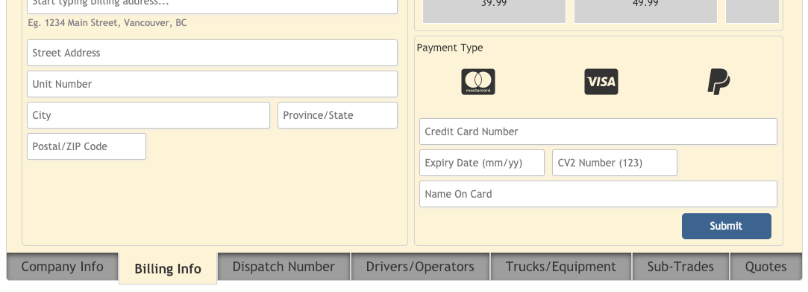

## mjfTabBar

Creates a basic tab bar inside the associated div element

## Install
    meteor add michaelfalk:mjf-tab-bar

## Quick Use

In your onRendered or onCreated helpers (or wherever)...

	$('#myTabBar').mjfTabBar({
            tabBarId: 'String value', //optional
            tabs: ['tab1', 'tab2', 'etc...'],
            activeTabColor: 'rgba() or hex', //optional
            inActiveTabColor: 'rgba() or hex', //optional
            inActiveHoverTabColor: 'rgba() or hex', //optional
    
            onSelect: function(data) { //optional... but what good would it be without any action...? ;)
                ...do something here with 'data' if you please...
            }
        });

## Summary

Creates a basic tab bar inside the associated div element

## Example:
 
     $('#myTabBar').mjfTabBar({
            tabBarId: 'String value', //optional
            tabs: ['tab1', 'tab2', 'etc...'],
            activeTabColor: 'rgba() or hex', //optional
            inActiveTabColor: 'rgba() or hex', //optional
            
            onSelect: function(data) { //optional
                ...do something here with 'data' if you please...
            }
        });

 If no "tabBarId" is provided in the "tabBarId" option a unique value will be created automatically

 onSelect event returns a data object with the following properties:
 
    data.id = a unique name for the individual tab based on the text value assigned to it in the tabs array in options
    data.index = numerical value based on a 0 (zero) based index
    data.text = string value reflecting the text within the tab

 Default CSS rules listed at end of file...

 Future updates...?
 
    Tab Orientation (ie. Top, Left, Right...) Currently it places the tabs at the bottom# mjfTabBar

